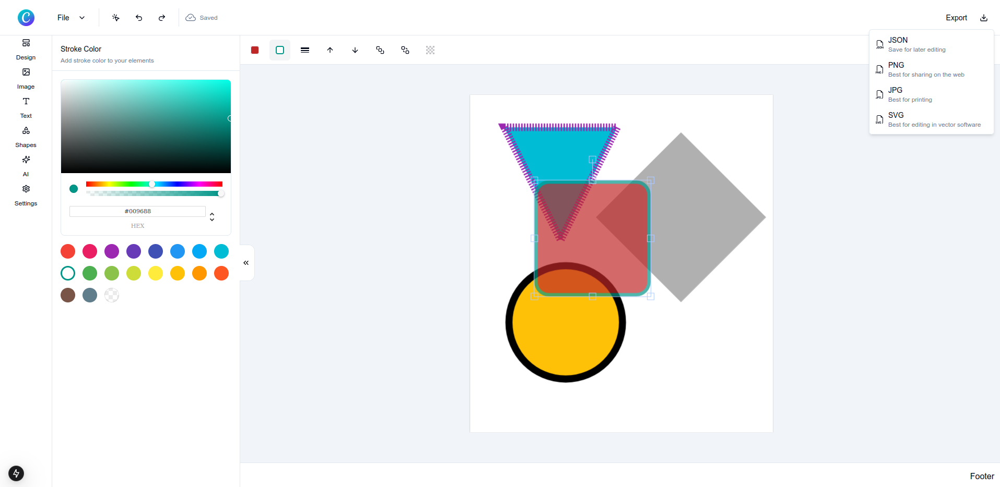

# Canva Clone | Design & AI Tool

🔗 Production URL: Coming soon 😉

A lighweight clone of Canva design app. This clone highlights fundamental features of Canva with design tools along with AI.

## Status: In Progress

I'm building a Canva clone featuring a comprehensive graphic design editor with an intuitive templates system, advanced text tools, and shape manipulation capabilities. The platform supports freehand drawing, undo/redo history, and real-time autosave. It includes AI-powered image generation and background removal using Replicate, and secure authentication with Next-Auth v5. Additionally, it handles payments and subscriptions via Stripe, allows project exports in multiple formats, and is built with Next.js, Hono.js, NeonDB, DrizzleORM, TailwindCSS, and Shadcn UI.
